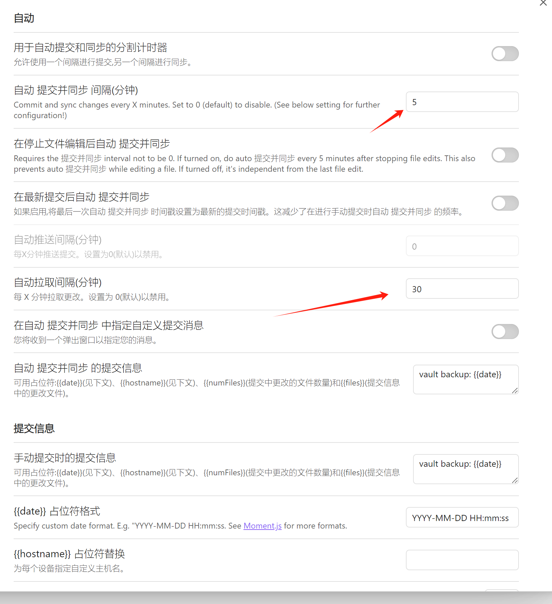

**<font color="#ff0000">提示：部分内容由 AI 创作，本人不保证真实、准确性，仅经过本人审核，对于资料真伪请自行判别</font>**


**插件使用原则**：
1. **不滥用插件**：插件是为了提升效率，而非增加负担。选择必要的插件，避免过度依赖。
2. **够用就好**：插件功能满足需求即可，不必追求最新或最全的插件。
3. **及时更新**：插件更新以修复问题为主，功能更新非必需时无需频繁更新。
4. **保持简洁**：插件过多会导致 Obsidian 变慢，影响使用体验。定期清理不必要的插件。

**核心原则**：插件是工具，笔记是核心。不要让插件喧宾夺主，保持笔记的简洁和高效。

---

## 核心插件

### 模板
·                                                                                                    
设置=》核心插件=》模板启用
![[Pasted image 20220724231433.png|800]]
参数设置=》选择模板文件夹
![[Pasted image 20220724231521.png|800]]

<font color="#00b050">评价：简单，方便，好用，但非必需</font>


## 第三方插件

### 插件管理与辅助
####  插件下载市场 Pkmer Market （必装）


[PKMer](https://pkmer.cn/)是一个国内加速的 Obsidian 插件市场，提供了大量插件的下载服务。由于 Obsidian 的官方插件市场位于外网，国内用户在不使用科学上网的情况下可能无法正常下载插件。PKMer 社区将外网的插件搬运到国内，并创建了一个免费的国内插件市场。

**使用方法**：
1. 下载并安装 PKMer 插件。
2. 登录 PKMer 账号。
3. 通过该插件直接下载其他 Obsidian 插件。


**设置**


<font color="#00b050">评价： 非常方便快捷感谢！国内用户必备</font>

#### 翻译插件 i18n （必装）
i18n 是一个用于 Obsidian 的国际化插件，可以帮助用户将界面语言切换为多种语言。

[终于可以用上中文的obsidian插件了！ob插件汉化/翻译/国际化工具 ob-i18n正式发布！_哔哩哔哩_bilibili](https://www.bilibili.com/video/BV1VcxJeNExx/)

追加介绍，不要开启这个选项，我能理解作者恰饭的需求，只是我个人不喜欢，

会有这个侧边栏

<font color="#00b050">评价： 非常方便快捷感谢！英文不好的小伙伴必备！</font>

#### AI 辅助  Smart Composer (必装)                                                                                                                                                                                                        

[glowingjade/obsidian-smart-composer: AI chat assistant for Obsidian with contextual awareness, smart writing assistance, and one-click edits. Features vault-aware conversations, semantic search, and local model support.    ](https://github.com/glowingjade/obsidian-smart-composer)

旨在通过AI帮助用户高效写作，并能够轻松引用库中的内容。以下是其主要特点和功能：

 **主要功能**
1. **<span style="background:rgba(3, 135, 102, 0.2)">上下文聊天  (好用，爱用)</span>**：
    - 允许用户选择特定的文件或文件夹作为对话的上下文。
    - 支持多媒体内容（如图片、网站链接、YouTube视频）作为额外上下文。
2. **<span style="background:#fff88f">应用编辑 （暂时我觉得不好用）</span>**：
    - 提供文档修改建议，用户可以通过一键应用这些建议。
3. **<span style="background:#40a9ff">库搜索</span>（RAG）**：
    - 自动从库中查找相关笔记，以增强AI的响应。
4. **自定义模型选择**：
    - 支持使用本地模型（如Ollama）或自定义API密钥（如OpenAI、Anthropic、Gemini等）。                                                                      
5. **提示模板**：
    - 创建和重用常见查询的模板，提升重复任务的效率。

如果有 openAI 等模型的 key, 可直接填写后选用，也可以使用自定义的模型（openAI 兼容）


<font color="#00b050">评价： 高效写作助手，好用，方便，有学习成本但是值得学习！</font>
### 编辑增强

#### 编辑工具栏 Editing Toolbar （必装）

提供了类似 Word 的编辑工具栏，方便用户快速格式化文本。

**主要功能**：
1. **常用格式**：支持加粗、斜体、删除线等
2. **快速插入**：支持插入链接、图片、代码块等
3. **快捷键支持**：可以通过快捷键快速调用工具栏功能
4. **自定义配置**：用户可以根据需求自定义工具栏按钮


**自定义快捷键**


<font color="#00b050">评价： 非常方便快捷感谢！高度的定制化，必不可缺的插件</font>


#### 自定义命令添加 Commander （必装）
允许用户自定义工具栏按钮和命令。通过该插件，用户可以将常用的操作添加到工具栏中，方便快速访问。以下是其主要功能：

**主要功能**：
1. **自定义工具栏**：可以添加、删除或重新排列工具栏按钮
2. **快速执行命令**：将常用命令绑定到工具栏按钮，一键执行
3. **多平台支持**：支持桌面端和移动端
4. **高度可定制**：用户可以根据需求自定义按钮图标和命令


<font color="#00b050">评价： 好用，简单，方便，易用！</font>

#### 自动补全表格  Advanced Tables （必装）

自动补全表格 Advanced Tables

| 测试 | 测试 2 |
| -- | --- |
| a  | b   |

默认生效，启用即可
<font color="#00b050">评价：简单易用</font>

#### 代码块显示增强 Better codeblock （必装）
用于增强代码块的显示效果，支持在阅读视图中为代码块添加标题、行号和折叠按钮。

**主要功能**：
1. **添加标题**：使用 `TI:"your title"` 为代码块添加标题，点击标题可折叠/展开代码块
2. **行号显示**：自动显示代码行号
3. 
4. **高亮显示**：使用 `HL:"1,2,3"` 或 `HL:"1-3"` 高亮指定行


**设置建议**：
- 在排除语言列表中添加 `dataview,dataviewjs` 以避免与 Dataview 插件冲突


**注意事项**：
- 修改后需重新打开文件才能看到效果
- 有时会出现自动换行错误，可通过切换预览模式解决
- PDF 导出时可能无法自动换行

<font color="#00b050">评价： 简单，方便，易用！</font>

#### Easy Typing （选装）
包含编辑时自动格式化文本和符号编辑增强。

- 自动化：
    - 首字母大写
    - 中英文间插入空格/中文间消除空格/标点与文本间插入空格
    - 符号配对/删除
        - 符号自动配对
        - 配对符号删除
- 自定义
    - 自定义不同区块间的空格策略
    - 自定义正则区块
    - 
[PKMer_Obsidian 插件：Easy Tpying 自动格式化你的中英文标点输入格式](https://pkmer.cn/Pkmer-Docs/10-obsidian/obsidian%E7%A4%BE%E5%8C%BA%E6%8F%92%E4%BB%B6/easy-typing-obsidian/)

默认生效，启用即可
<font color="#00b050">评价：简单易用</font>

### 文件管理
#### 文件清理 File Cleaner （必装）
清理没有引用的文件 （图片），建议修改设置为移动到内部的. Trash 文件夹内，防止误删除


<font color="#00b050">评价：简单易用</font>

#### 方便快速查看和回溯最近的文件 Recent Files （选装）

在侧边栏显示最近打开的文件列表，方便快速查看和回溯最近的文件。

**主要功能**：
1. **最近文件列表**：点击侧边栏的时钟图标即可查看最近浏览的文件
2. **多种打开方式**：支持在当前标签页、新标签页或新窗口中打开文件
3. **文件过滤**：可以排除特定文件夹或文件类型


**使用方法**：
1. 安装插件后，侧边栏会出现一个时钟图标
2. 点击图标即可查看最近浏览的文件列表
3. 可以通过设置调整列表长度和打开方式


<font color="#00b050">评价：方便快速回溯最近文件，适合需要频繁切换文件的用户</font>


#### 自动同步仓库 Obsidian Git (必装)
[denolehov/obsidian-git: Backup your Obsidian.md vault with git (github.com)](https://github.com/denolehov/obsidian-git)

1、设置自动提交并同步的间隔
2、设置自动拉取间隔 
3、设置打开 obsidian后自动拉取




### 阅读与标注

#### Pdf 阅读工具 PDF++ (必装)
以下是关于 Obsidian 插件 **PDF++** 的简要总结：

 **插件简介**
- **PDF++** 是 Obsidian 的一款 PDF 标注增强插件，适合用于读书笔记。
- 主要功能包括：
  - **高亮注释**：将 PDF 文件中的反向链接转换为高亮注释。
  - **注释同步**：支持将注释直接添加到 PDF 文件中，外部软件也可查看。
  - **查看器增强**：提升内置 PDF 查看器的体验。

 **推荐设置**
1. **Editing PDF files**：关闭，避免文件损坏风险。
2. **Backlink highlighting**：
   - 自定义高亮颜色。
   - 开启 `Highlight backlinks in PDF embeds` 和 `Highlight backlinks in hover popover previews`。
   - 设置 `How to open the markdown file when no markdown file is opened` 为 `Split left`。
3. **PDF toolbar**：
   - 关闭 `Show zoom level box` 和 `Show "without specifying color" button in the color palette`。
4. **Link copy templates**：
   - 自定义注释模板，推荐使用以下代码：
     ```markdown
     > [!{{calloutType}}|{{color}}] {{linkWithDisplay}}
     > > {{text}}
     > 
     > 
     ```
5. **Auto-paste**：
   - 设置 `How to open target markdown file when not opened` 为 `Split left`。
   - 关闭 `Always open in editing view`。
   - 设置 `New note title format` 为 `Notes/{{ file.basename }}.md`。

**使用方法**
- 每个 PDF 文件对应一个 Markdown 文件。
- 打开 PDF 文件后，点击 `PDF++: Toggle auto-paste` 按钮启用自动粘贴功能。
- 选中文本后按快捷键，自动将注释粘贴到对应的 Markdown 文件中。

**注意事项**
- 插件设置较多，建议根据需求调整。
- 部分功能（如 `Editing PDF files`）存在风险，谨慎使用。

如需更详细的设置说明，可参考 [PKMer 文档](https://pkmer.cn/Pkmer-Docs/10-obsidian/obsidian%E7%A4%BE%E5%8C%BA%E6%8F%92%E4%BB%B6/pdf-plus/)。

默认生效，启用即可
<font color="#00b050">评价：简单易用</font>

#### PDF 导出增强 Better Export PDF （选装）
用于增强 Obsidian 的 PDF 导出功能，支持导出书签大纲和添加页码。

**主要功能**：
1. **自定义页边距**：调整 PDF 的页边距
2. **书签大纲**：导出时包含书签大纲
3. **页码**：为导出的 PDF 添加页码

默认生效，启用即可
<font color="#00b050">评价：适合需要导出 PDF 并希望保留书签和页码的用户</font>

#### 鼠标滚轮缩放图片 Mousewheel Image zoom （必装）

默认生效，启用即可
<font color="#00b050">评价：简单易用</font>

#### 增强图片的查看和管理 Image Toolkit （选装）
用于增强图片的查看和管理功能。

**主要功能**：
1. **图片缩放**：支持通过鼠标滚轮或快捷键缩放图片。
2. **图片旋转**：可以旋转图片以调整视角。
3. **图片标注**：支持在图片上添加标注或注释。
4. **图片预览**：在悬浮窗口中预览图片，方便快速查看。

默认生效，启用即可
<font color="#00b050">评价：简单易用</font>

### 多媒体支持
#### 视频插件 Media Extended 和 Media Extended BiliBili（选装）

**一边视频，一边笔记**需要安装两个插件到**Obsidian**，运行这两个插件——**Media Extended和Media Extended BiliBili**，把视频链接粘贴到笔记中，就可以用阅读视图打开笔记，打开视频链接就可以观看分屏视频或者悬浮视频。

**详细介绍**
[科研笔记神器：​​一边视频，一边笔记，轻松搞定B站视频学习 - 知乎](https://zhuanlan.zhihu.com/p/466468893)
**示例**
[Obsidian插件Media Extended视频加时间戳_哔哩哔哩_bilibili](https://www.bilibili.com/video/BV1UY411b7E3/?vd_source=ccbe0c793ac5e34ebb735794692f049e)
[Johnny学OB 第18集 - 用OB给音频和视频加时间戳，你想看哪儿，就去看哪儿，更加高效的学习。Media Extended详细教程 Obsidian教程_哔哩哔哩_bilibili](https://www.bilibili.com/video/BV1hf4y1P7iN/)

**个性化设置**
对于需要登录的网站，可以通过这里登录

设置视频分辨率


<font color="#ff0000">冲突：和 surfing 插件有些冲突，有时想要打开网页，结果因为是 b 站的链接直接被打开为视频了</font>

#### 绘图插件 Excalidraw（选装）

安装第三方插件 excalidraw
![[附件/插图测试|218]]

<font color="#00b050">评价：简单易用</font>

### 其他工具
#### 大纲增强 Quiet Outline （选装）
用于增强 Obsidian 的大纲功能，提供更清晰的大纲展示和管理。

**主要功能**：
1. **标题搜索**：支持在大纲中快速搜索标题
2. **层级控制**：可设置默认展开层级，支持批量调整
3. **拖拽调整**：通过拖拽标题调整文档结构
4. **Markdown 渲染**：支持在大纲中显示粗体、斜体、数学公式等 Markdown 元素
5. **滚动同步**：大纲层级随页面滚动自动展开或折叠

<font color="#00b050">评价：简单易用</font>

#### 标签页增强 Home Tab （选装）
用于替换 Obsidian 默认的新标签页，提供多功能主页视图，包括搜索栏、星标文件和最近修改文件列表。

**主要功能**：
1. **搜索功能**：支持按文件类型或扩展名筛选搜索结果
2. **最近文件**：显示最近修改的文件列表
3. **星标文件**：展示已标记为星标的文件
4. **自定义样式**：可修改图标、标题、字体等外观设置

**使用方法**：
1. 安装插件后，新标签页会自动替换为 Home Tab 视图
2. 可通过命令面板手动打开 Home Tab 视图

**设置建议**：
- 在设置中调整搜索延迟、显示文件数量等参数
- 自定义图标和标题，打造个性化主页
其中 showw recent Files 功能与插件 [Recent Files ](obsidian%20插件篇.md#方便快速查看和回溯最近的文件%20Recent%20Files%20（选装）) 功能类似，但是个人认为使用插件效果更好，所以不启用该功能。


<font color="#00b050">评价：简单，方便，易用，适合需要快速访问常用文件的用户</font>

####  提供类似 vscode 的编辑器 Vscode-editor （选装）

基于 Monaco Editor（VSCode Editor 内核）开发，支持查看和编辑各种代码格式文件。默认支持以下语言：
- C、C++、C#、Go、HTML
- Java、JavaScript、JSON
- Python、Ruby、Rust
- Shell、XML、YAML、ini

可在插件设置中添加更多语言。

**特点**：
- 支持 VS Code 快捷键（复制、粘贴、保存、注释、缩进、行移动等）
- 适配暗色和亮色主题
- 支持右键编辑 md 文件中的代码块
- 支持 md 链接快速预览代码文件（需开启“检测所有类型文件”）

#### 内嵌至浏览器 Surfing （选装）
Surfing 是一个 Obsidian 插件，允许你在 Obsidian 中像使用浏览器一样浏览网页。

**主要功能**：
1. **浏览任意网页**：点击链接后直接在 Obsidian 中打开
2. **网页搜索**：在编辑器或网页内右键使用默认搜索引擎搜索选中的关键字
3. **复制高亮链接**：选中文字后，可以复制指向该处的链接
4. **书签管理**：支持在 Obsidian 中维护浏览器书签
5. **浏览历史记录**：支持前后跳转网页，并清除浏览历史记录
6. **夜间模式**：提供简单的夜间模式，优化夜间浏览体验

<font color="#00b050">评价：功能强大，适合需要在 Obsidian 中浏览网页的用户</font>

#### 自定义浏览器应用 Custom Frames （选装）
用于在 Obsidian 中以 iframe 方式将网页应用集成到标签页中，支持自定义网页链接和样式。


**主要功能**：
1. **自定义网页集成**：通过 iframe 将网页应用嵌入 Obsidian 中
2. **笔记模式**：支持在 Markdown 笔记中通过代码块嵌入网页
3. **预置应用**：默认提供 Google Keep、Todoist 等常用网页应用
4. **自定义设置**：支持添加图标、调整样式、设置移动端禁用等

**使用方法**：
1. 在插件设置中添加自定义网页链接
2. 通过代码块语法在笔记中嵌入网页应用

**注意事项**：
- 移动端部分功能可能无法正常使用
- 需要 Obsidian 0.14.2 以上版本支持

功能与[内嵌至浏览器 Surfing （选装）](#内嵌至浏览器%20Surfing%20（选装）|Surfing)插件高度重合，且提供了更加丰富的功能栏，可以二选一，但是 Surfing 插件提供了链接标签至网页的功能，该功能也是我需要的，所以暂时保留两个插件，如果后期增加了链接标签至网页，将移除 Surfing 插件，只保留该插件。
<font color="#00b050">评价：适合需要在 Obsidian 中集成网页应用的用户</font>

## 结语

至此，插件篇目前（205-01-24）来说算是完结了，之后非必要不增添插件，也不花更多时间在插件研究上面。实际上，在整理插件的时候，我又忍不住去探索了一番，这点需要反省。以后要更加注重内容，而不是在插件上面。